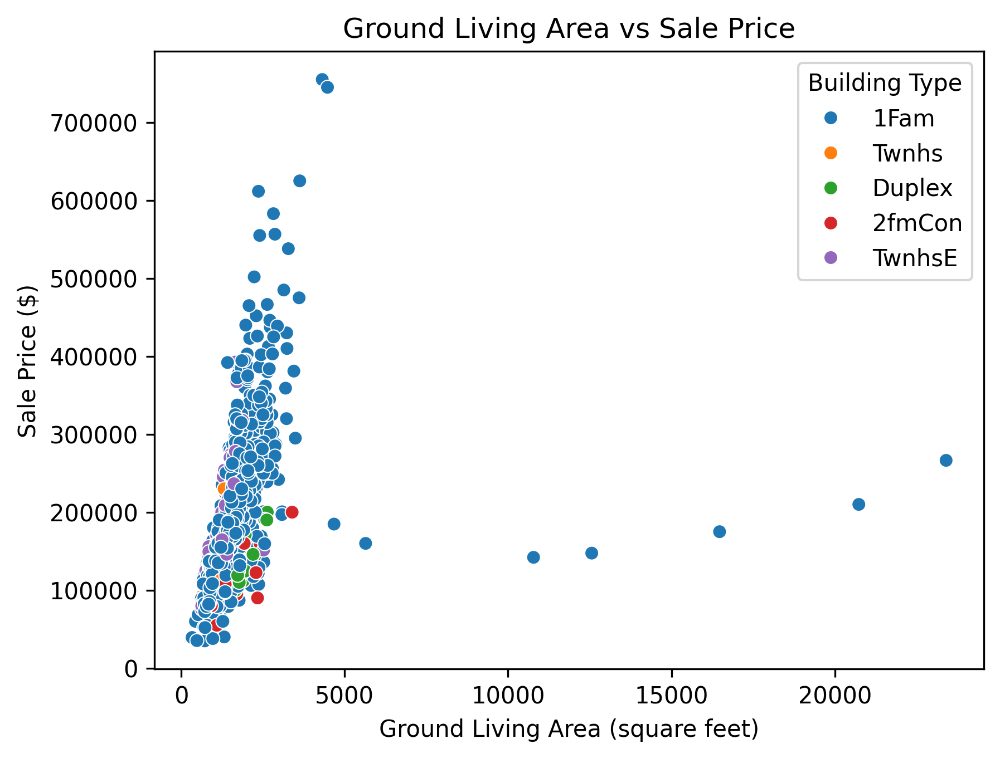
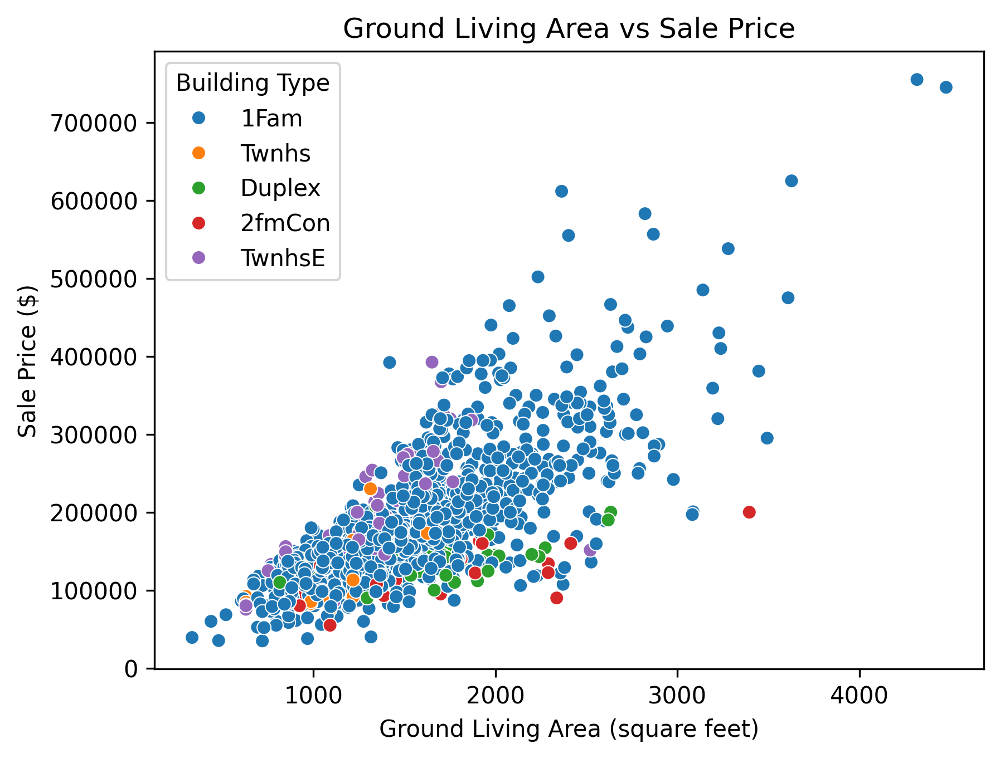
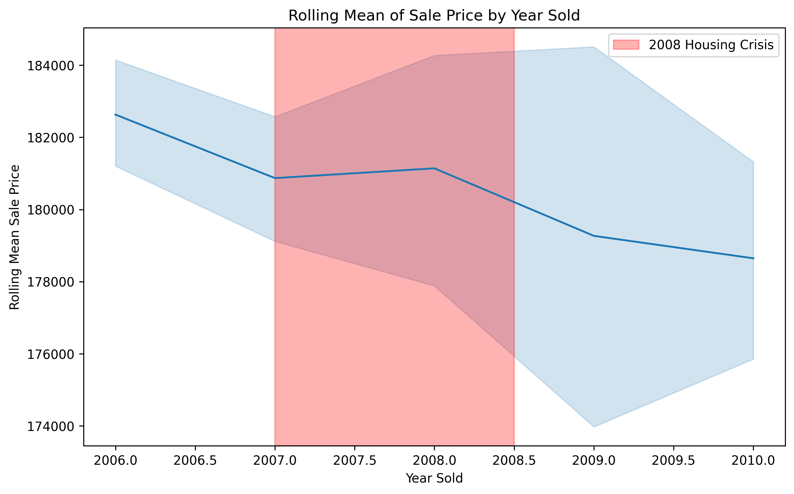
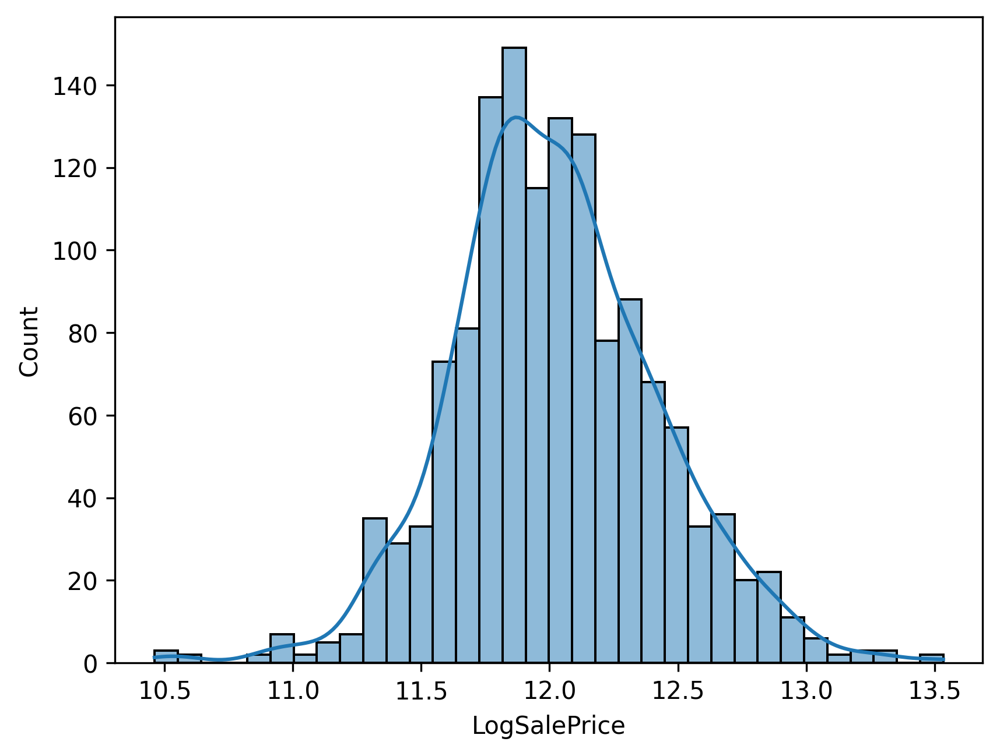
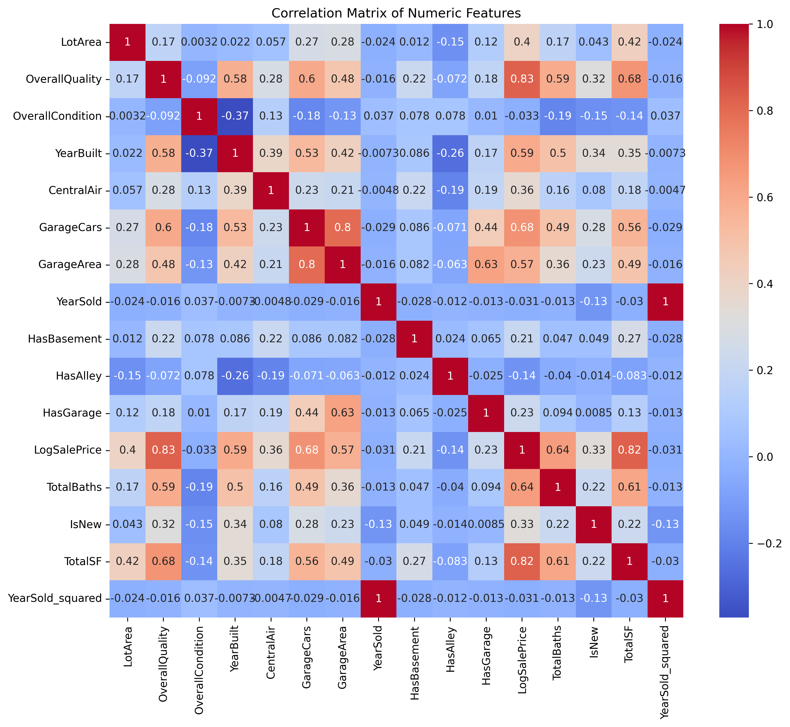
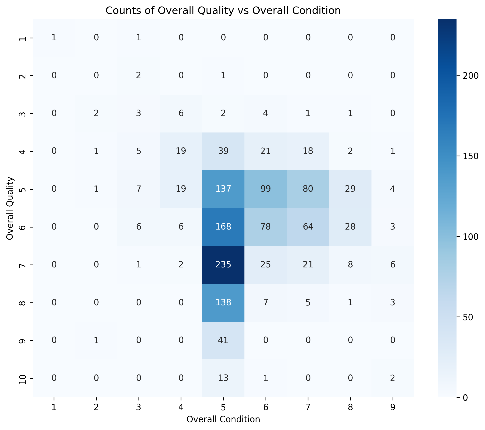
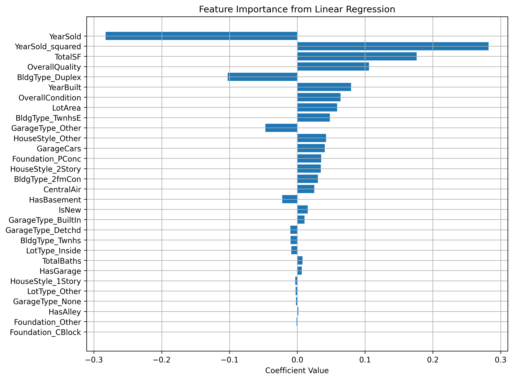

# House Price Prediction Using Linear Regression

## Project Overview

This project develops a complete machine learning pipeline to predict residential home sale prices based on various property characteristics. The dataset covers housing sales from 2006-2010, a period marked by significant market volatility including the 2008 financial crisis. Using linear regression as the primary modeling approach, this project demonstrates robust data preprocessing, feature engineering, and model evaluation techniques.

## Objective

Build an end-to-end machine learning pipeline that:
- Accurately estimates home sale prices using property features
- Handles real-world data quality issues through systematic cleaning and preprocessing
- Creates meaningful engineered features to improve predictive performance
- Develops a robust linear regression model with strong generalization capabilities

## Dataset Description

The dataset contains 24 features describing residential properties, including:
- **Physical characteristics**: Lot area, living area, basement area, garage specifications
- **Quality metrics**: Overall quality and condition ratings (1-10 scale)
- **Property details**: Building type, house style, foundation type
- **Amenities**: Central air, number of bathrooms, garage capacity
- **Temporal features**: Year built, year sold
- **Transaction details**: Sale type and condition
- **Target variable**: Sale price (continuous)

## Methodology

### Data Cleaning and Preprocessing

The data cleaning process addressed several critical quality issues:

1. **Data Entry Errors**: Removed properties with foundation type labeled "Do Not use this Field in the Model" and cleaned malformed entries in the `GarageArea` field using regular expressions
2. **Standardization**: Merged duplicate categories (e.g., "Normal" and "normal" in `SaleCondition`)
3. **Outlier Removal**: Identified and removed extreme outliers where homes had unusually large ground living areas (>4500 sq ft) but disproportionately low sale prices

*Figure 1: Scatter plot showing the relationship between ground living area and sale price before outlier removal. Notice the extreme outliers with very large living areas but disproportionately low prices.*

*Figure 2: The same relationship after removing outliers. The data now shows a clearer linear trend, reducing the potential for model distortion.*

4. **Data Consistency**: Corrected entries where `GarageType` was specified but `GarageArea` was zero

### Exploratory Data Analysis

Comprehensive EDA revealed important patterns and relationships:

**Key Findings:**
- Strong positive correlation between property size (`TotalSF`, `GrLivArea`) and sale price
- `OverallQuality` showed the strongest correlation with sale price among quality metrics
- `OverallCondition` had minimal correlation with sale price despite initially appearing important
- Significant heteroskedasticity observed in larger homes, with greater price variance
- Clear temporal trends showing the impact of the 2008 housing crisis on sale prices
- Most categorical features exhibited class imbalance requiring consolidation of rare categories

**Distribution Analysis:**
- Sale prices were right-skewed with significant outliers in the upper range
- Lot area demonstrated extreme right skewness requiring transformation
- Most properties were single-family homes on paved streets with attached garages
- The majority of homes had 1-2 full bathrooms and 0-1 half bathrooms

**Temporal Patterns:**
- Rolling mean analysis of sale price by year built revealed dips corresponding to historical economic downturns (1921 post-WWI recession, 1972 stagflation, 2000 dot-com bubble)
- Sharp decline in sale prices between 2007-2008 directly reflected the housing market crash
- Year sold proved to be a critical predictor due to the volatile market conditions during the dataset period

*Figure 3: Rolling mean of sale prices by year sold, clearly showing the dramatic impact of the 2008 housing crisis. The sharp decline between 2007-2008 demonstrates why temporal features became critical predictors in the model.*

### Feature Engineering

Strategic feature engineering improved model performance and interpretability:

**Binary Indicators:**
- `HasBasement`: Presence of basement (1 = yes, 0 = no)
- `HasAlley`: Alley access availability (1 = yes, 0 = no)
- `HasGarage`: Garage presence (1 = yes, 0 = no)
- `CentralAir`: Central air conditioning system (1 = yes, 0 = no)
- `IsNew`: Newly built home indicator derived from sale type

**Composite Features:**
- `TotalBaths`: Combined full and half bathrooms (half baths weighted as 0.5)
- `TotalSF`: Total livable square footage (sum of basement area and ground living area)

**Transformations:**
- `LogSalePrice`: Log transformation of target variable to reduce skewness and stabilize variance
- `LotArea`: Log transformation to normalize right-skewed distribution
- `YearSold_squared`: Polynomial term to capture nonlinear temporal trends (e.g., housing crisis impact)

*Figure 4: Distribution of sale prices after log transformation. The transformation successfully normalized the right-skewed distribution, addressing heteroskedasticity and improving model performance.*

**Category Consolidation:**
- Grouped rare categories in `HouseStyle`, `LotType`, `Foundation`, `GarageType`, and `SaleType` into "Other" to prevent overfitting and reduce noise
- Simplified `SaleType` into binary `IsNew` indicator after determining equivalence with `SaleCondition`

**Feature Reduction:**
- Dropped `Alley` column (only 7% of properties had alleys)
- Removed `Street` due to extreme imbalance (99.5% paved roads)
- Eliminated `SaleCondition` as redundant with `IsNew`
- Dropped `GarageArea` to avoid multicollinearity with `GarageCars`
- Removed original `TotalBsmtSF` and `GrLivArea` after creating `TotalSF`

*Figure 5: Correlation heatmap revealing relationships between numeric features. High correlation between GarageCars and GarageArea justified removing GarageArea. Strong correlations between TotalSF, OverallQuality, and LogSalePrice validated their importance as predictors.*

*Figure 6: Cross-tabulation heatmap showing the relationship between Overall Quality and Overall Condition. Despite both being centered around average values (5-7), their low correlation (-0.092) indicated they capture different aspects of property characteristics.*

### Model Development

**Preprocessing Pipeline:**
- Numerical features: Standardized using `StandardScaler` to ensure equal weighting
- Categorical features: One-hot encoded with drop='first' to avoid multicollinearity
- Combined transformations using `ColumnTransformer` for streamlined preprocessing

**Model Selection:**
Linear regression was chosen for its interpretability and suitability for this regression task, particularly after addressing heteroskedasticity through log transformation of the target variable.

**Train-Test Split:**
80-20 split with random state for reproducibility (random_state=141099)

## Results

### Model Performance

**Evaluation Metrics:**
- **RMSE (Root Mean Squared Error)**: 0.1347 (on log scale)
- **R-squared**: 0.8911

**Interpretation:**

Since the target variable was log-transformed, the RMSE of 0.1347 corresponds to a multiplicative error. Converting back to the original scale:
- Average relative prediction error: approximately 14.4%
- With an average home price of $180,996, this translates to an average error of roughly $26,000

The R-squared score of 0.8911 indicates that the model explains approximately 89% of the variance in log-transformed sale prices. This represents strong predictive performance, particularly given the complexity and noise inherent in housing market data during this volatile period.

### Feature Importance

The most influential predictors in the final model were:

1. **YearSold and YearSold_squared**: By far the largest coefficients, reflecting the critical importance of sale timing during the 2008 housing crisis period
2. **TotalSF**: Total square footage showed strong positive relationship with price
3. **OverallQuality**: Quality ratings had substantial impact on sale price
4. **Building Type and Garage Type**: Categorical features showed moderate influence

The dominance of temporal features (`YearSold`, `YearSold_squared`) highlights how market conditions during 2006-2010 strongly influenced prices, overshadowing many traditional property characteristics.

*Figure 7: Coefficient magnitudes from the linear regression model showing feature importance. YearSold and YearSold_squared dominate due to the volatile market conditions during the 2008 crisis, while TotalSF and OverallQuality represent the most important traditional property characteristics.*

## Key Learnings

### Exploratory Data Analysis Insights

1. **Heteroskedasticity Detection**: Visual analysis revealed that variance in sale prices increased with property size, violating OLS assumptions. Log transformation of the target variable effectively addressed this issue.

2. **Temporal Context Matters**: Understanding the dataset's time period (2006-2010) was crucial for interpreting patterns. The 2008 financial crisis had an outsized impact on sale prices, making temporal features unexpectedly important.

3. **Correlation vs. Causation**: While `OverallCondition` and `OverallQuality` were initially expected to be similarly important, only quality proved to be a strong predictor. This demonstrates the importance of empirical validation over assumptions.

4. **Class Imbalance Handling**: Many categorical features had rare categories with few observations. Consolidating these into "Other" categories reduced noise and improved model stability without significant information loss.

5. **Feature Relationships**: Correlation analysis revealed that `GarageCars` and `GarageArea` were highly correlated, but `GarageCars` was retained as more interpretable from a buyer's perspective.

### Machine Learning Techniques

1. **Log Transformation Benefits**: Applying log transformation to both the target variable and highly skewed features (like `LotArea`) normalized distributions, reduced the influence of outliers, and improved model performance.

2. **Feature Engineering Impact**: Creating composite features like `TotalSF` and `TotalBaths` captured more meaningful relationships than individual components, while polynomial features like `YearSold_squared` allowed the linear model to capture nonlinear trends.

3. **Preprocessing Pipeline**: Using scikit-learn's `Pipeline` and `ColumnTransformer` ensured consistent preprocessing between training and test sets, preventing data leakage and improving reproducibility.

4. **Multicollinearity Management**: Identifying and removing highly correlated features (e.g., `GarageArea` when `GarageCars` was present) improved model interpretability without sacrificing predictive power.

5. **Model Evaluation**: Using both RMSE and R-squared provided complementary views of model performance—RMSE in interpretable units and R-squared for variance explained.

6. **Domain Knowledge Integration**: Understanding real estate fundamentals (e.g., buyers care about number of garage spaces more than exact square footage) informed better feature selection decisions.

## Technical Implementation

**Libraries Used:**
- **Data manipulation**: pandas, numpy
- **Visualization**: matplotlib, seaborn
- **Machine learning**: scikit-learn (preprocessing, modeling, evaluation)

**Python Version:** 3.13.2

## Conclusion

This project successfully developed a linear regression model that predicts house sale prices with 89% variance explained (R² = 0.8911) and an average prediction error of approximately $26,000 (14.4% relative error). The analysis demonstrated the importance of thorough exploratory data analysis, strategic feature engineering, and careful handling of real-world data quality issues.

The unexpectedly high importance of temporal features underscores how economic context can dominate traditional property characteristics during periods of market volatility. This project serves as a practical example of applying classical machine learning techniques to real-world regression problems while accounting for distributional assumptions and data quality challenges.

## Author

Andrew Girgis
